```text
.
├── app.py
├── data
│   └── images
│       └── train
│           ├── sherlock.jpg
│           └── watson.jpg
├── figures
│   ├── kernels
│   │   ├── blur.png
│   │   ├── bottom-sobel.png
│   │   ├── emboss.png
│   │   ├── identity.png
│   │   ├── left-sobel.png
│   │   ├── outline.png
│   │   ├── right-sobel.png
│   │   ├── sharpen.png
│   │   └── top-sobel.png
│   └── outs
│       ├── blur-5bka4.png
│       ├── blur-sw9dc.png
│       ├── bottom-sobel-g3jqv.png
│       ├── bottom-sobel-locj6.png
│       ├── emboss-tdjiw.png
│       ├── emboss-x3q0q.png
│       ├── identity-ha7wv.png
│       ├── identity-xcg44.png
│       ├── left-sobel-tid8y.png
│       ├── left-sobel-z5qnf.png
│       ├── outline-bxnyo.png
│       ├── outline-sn5r6.png
│       ├── right-sobel-2s850.png
│       ├── right-sobel-uf4uv.png
│       ├── sharpen-lb09o.png
│       ├── sharpen-p4q1d.png
│       ├── top-sobel-0md2e.png
│       └── top-sobel-2myn4.png
├── model
│   ├── __init__.py
│   └── net.py
├── README.md
└── utils
    ├── data.py
    ├── image.py
    ├── __init__.py
    └── kernels.py

8 directories, 37 files

```

# Apply Custom Convolution Kernels
```shell script
python app.py 
```
```text
usage: app.py [-h]
              {outline,sharpen,emboss,blur,identity,left-sobel,right-sobel,bottom-sobel,top-sobel}

positional arguments:
  {outline,sharpen,emboss,blur,identity,left-sobel,right-sobel,bottom-sobel,top-sobel}

optional arguments:
  -h, --help            show this help message and exit
```
## Identity kernel
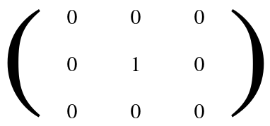

```shell script
python app.py identity
```
```text
saved at figures/outs/identity-xcg44.png
saved at figures/outs/identity-ha7wv.png
```

### Sherlock
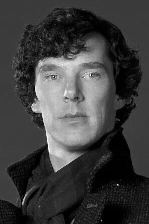

### Watson


## Outline kernel
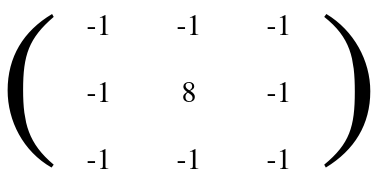

```shell script
python app.py outline
```
```text
saved at figures/outs/outline-sn5r6.png
saved at figures/outs/outline-bxnyo.png
```

### Sherlock
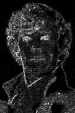

### Watson
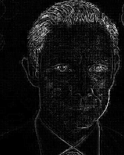


## Sharpen kernel
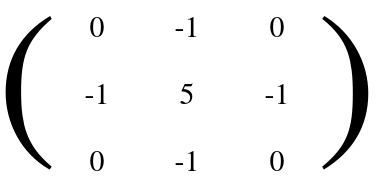

```shell script
python app.py sharpen
```
```text
saved at figures/outs/sharpen-lb09o.png
saved at figures/outs/sharpen-p4q1d.png
```

### Sherlock
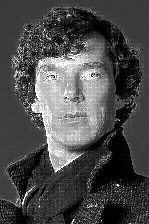

### Watson


## Emboss kernel
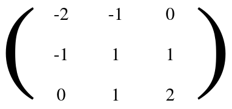

```shell script
python app.py emboss
```
```text
saved at figures/outs/emboss-x3q0q.png
saved at figures/outs/emboss-tdjiw.png
```

### Sherlock
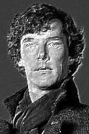

### Watson


## Blur kernel
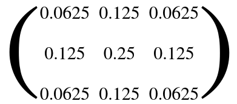

```shell script
python app.py blur
```
```text
saved at figures/outs/blur-sw9dc.png
saved at figures/outs/blur-5bka4.png
```

### Sherlock


### Watson


## Left-Sobel kernel
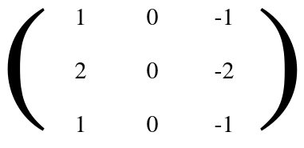

```shell script
python app.py left-sobel
```
```text
saved at figures/outs/left-sobel-tid8y.png
saved at figures/outs/left-sobel-z5qnf.png
```

### Sherlock
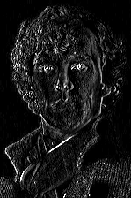

### Watson


## Right-Sobel kernel
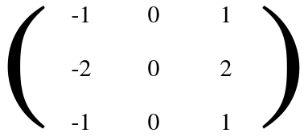

```shell script
python app.py right-sobel
```
```text
saved at figures/outs/right-sobel-uf4uv.png
saved at figures/outs/right-sobel-2s850.png
```

### Sherlock
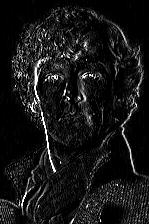

### Watson


## Top-Sobel kernel
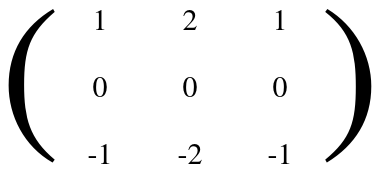

```shell script
python app.py top-sobel
```
```text
saved at figures/outs/top-sobel-2myn4.png
saved at figures/outs/top-sobel-0md2e.png
```

### Sherlock
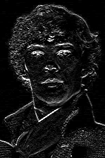

### Watson


## Bottom-Sobel kernel
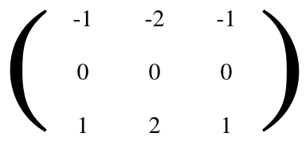

```shell script
python app.py bottom-sobel
```
```text
saved at figures/outs/bottom-sobel-g3jqv.png
saved at figures/outs/bottom-sobel-locj6.png
```

### Sherlock
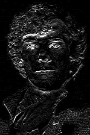

### Watson
